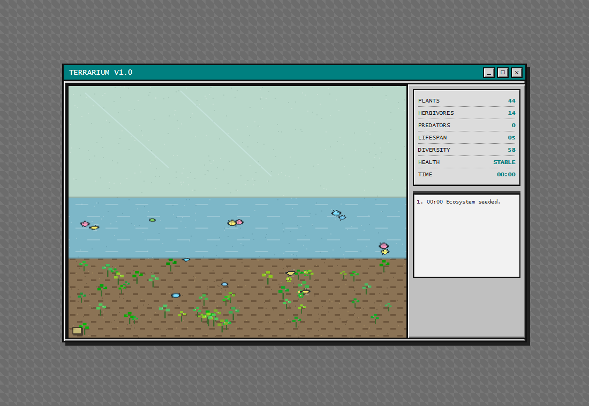

# Digital Terrarium

A retro pixel ecosystem you can leave running on your desktop like a little living widget.



## What It Does

Digital Terrarium is a 640x480 autonomous canvas simulation with plants, herbivores, and predators living inside a cozy early-2000s desktop window. The ecosystem runs on its own: plants spread, herbivores graze, predators hunt, populations rise and crash, and offspring occasionally mutate into new color and size variants.

## Features

- Autonomous food chain: plants to herbivores to predators
- Energy, age, starvation, reproduction, and lifespan systems
- Mutation events with color and size variation
- Spatial grid queries for efficient creature behavior
- Procedural pixel-art sprites and layered terrarium environment
- Hover-hidden sidebar controls for pause, speed, reset, modes, and export
- Population stats, diversity, health, elapsed time, and event history
- LocalStorage autosave/load with observe-mode recovery
- Snapshot PNG and JSON export controls
- Subtle Web Audio effects after first interaction

## Run Locally

```bash
npm install
npm run dev
```

Then open the local URL Vite prints in your terminal.

## Scripts

```bash
npm test
npm run build
npm audit --omit=optional
```

## Project Shape

- `src/ecosystem.js` has creature traits and behavior.
- `src/world.js` manages spawning, deaths, stats, spatial queries, and persistence state.
- `src/renderer.js` draws the pixel terrarium, sprites, particles, and glass frame.
- `src/ui.js` wires the stats sidebar and controls.
- `src/save.js` handles localStorage and exports.
